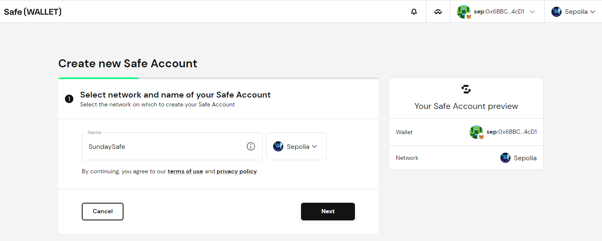
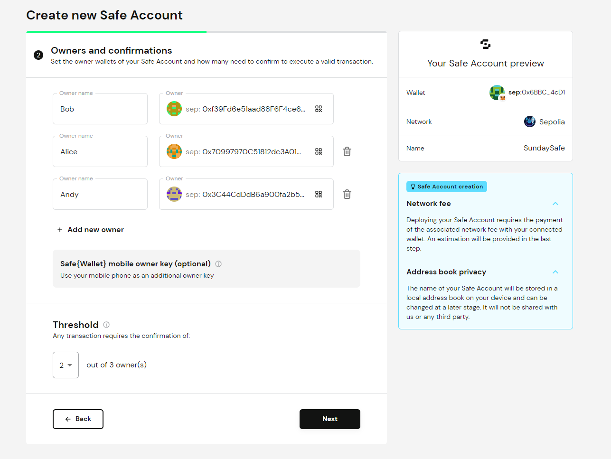
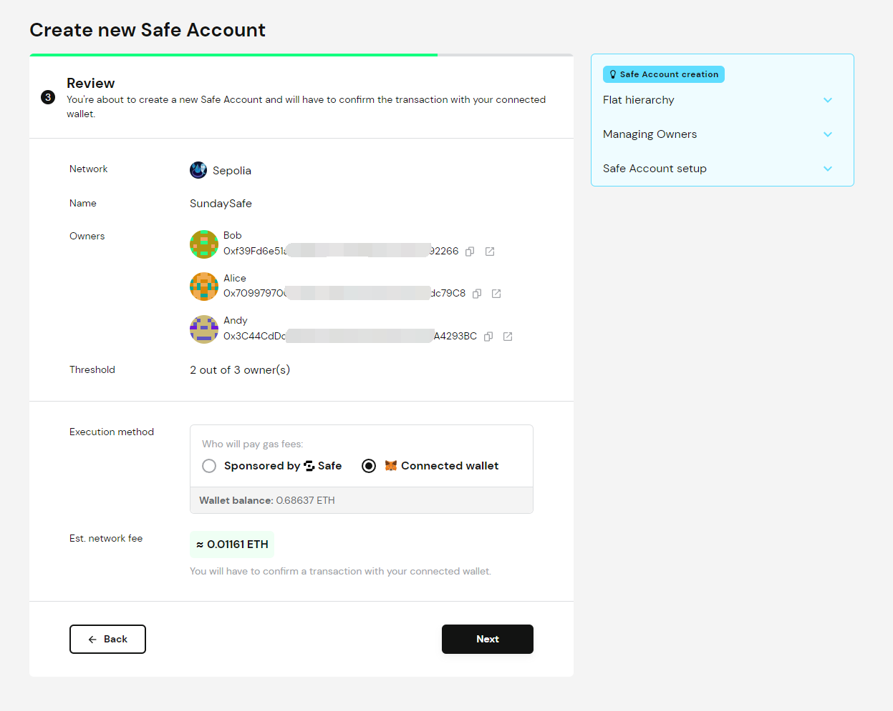
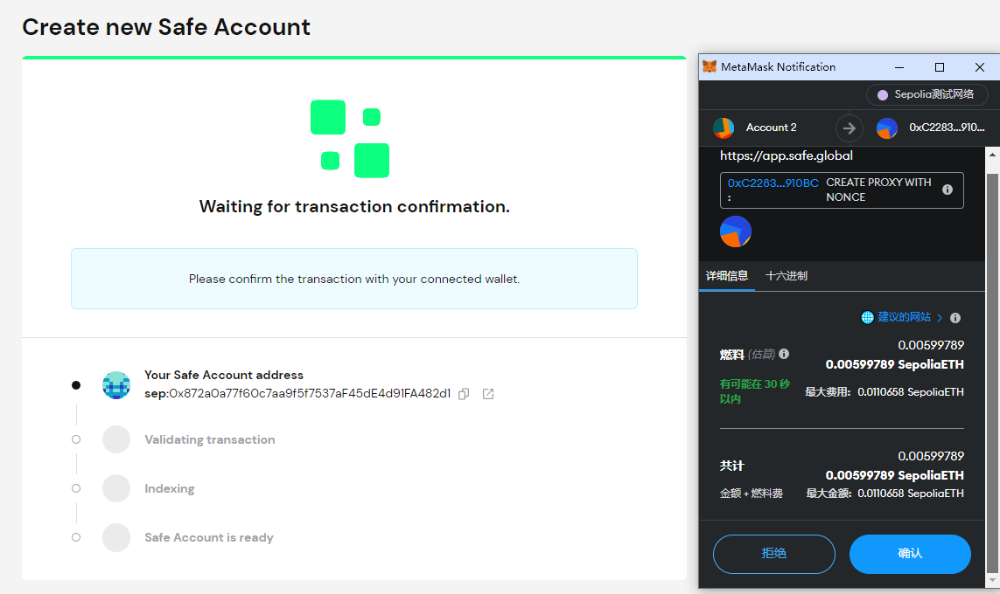
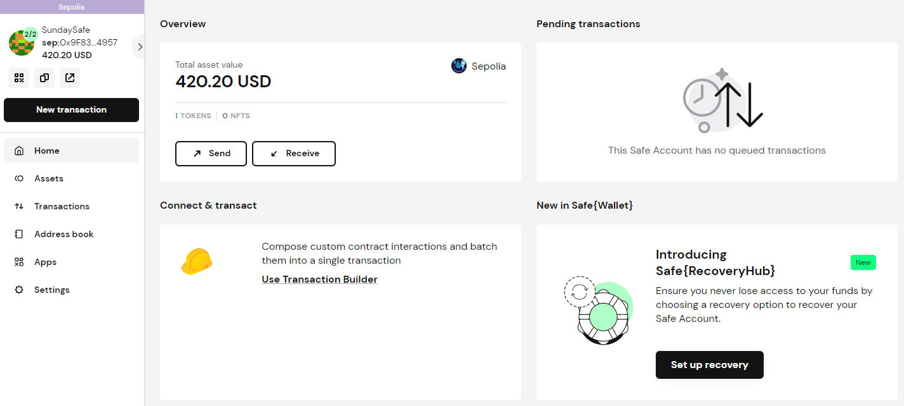
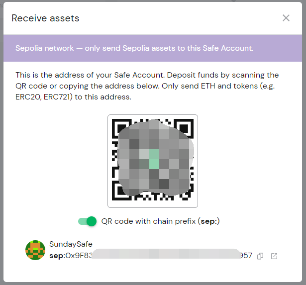
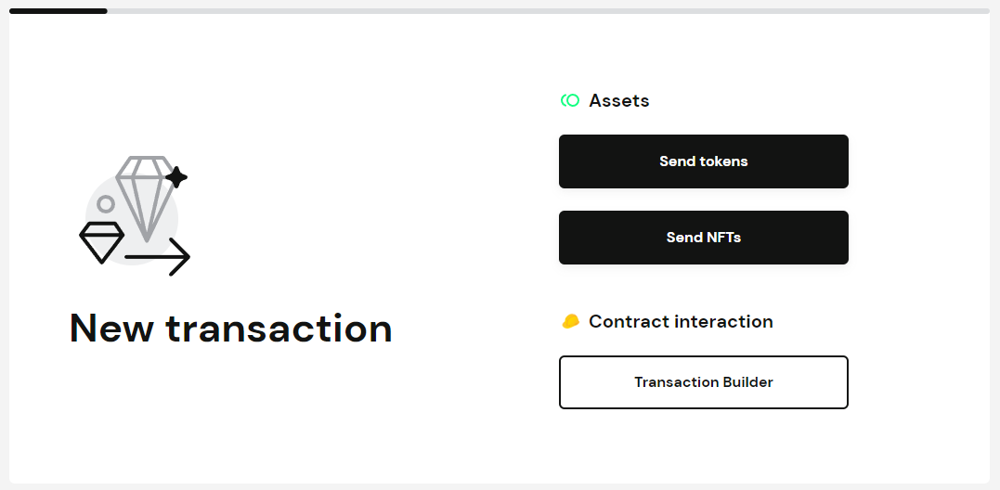
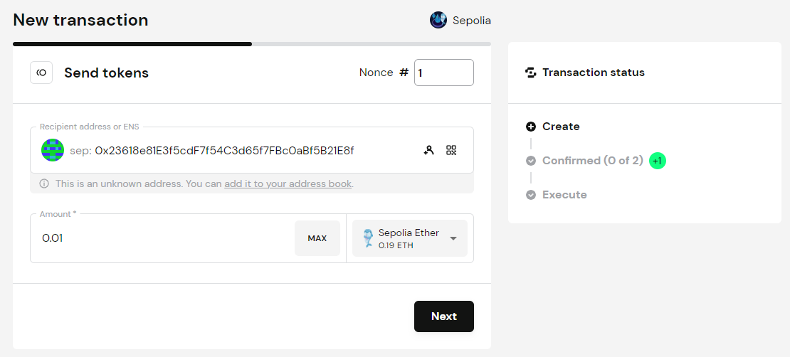

# Safe多签钱包实践

Safe原名：Gnosis Safe

Safe应用地址：https://app.safe.global/

Safe多签钱包是一个智能合约账户，只不过这个智能合约账户功能比较强大，需要多人签名才能将资产转出或调用其他合约，可用于集体资产管理。

### 创建Safe多签钱包
填写账户名，选择网络。

输入多签Owners钱包地址，选择交易所需的账户签名个数。

确认多签Owners钱包地址。

支付相关费用，支付完成后开始创建钱包。

### Safe多签钱包转入
往Safe多签钱包转入资产比较简单，直接往智能合约账户地址转账就可以。

点击左边Home主页按钮。

点击中间Receive按钮可以查看多签账户地址和二维码。往这个地址直接转账即可。

### Safe多签钱包转出和合约交互

转出和合约交互操作需要Owners签名。

点击主页中的Send按钮，打开创建交易界面，可以创建3种类型的交易。

- Send tokens        : 发送代币
- Send NTFs          ：发送NTF
- Transaction Builder：合约交互

点击Send tokens，填写Token转出相关信息。（Send NTFs 类似）

点击Transaction Builder，填写合约交互相关信息。

交易信息填写完成后，需要2/3个Owners签名才能创建交易。
等待矿工确认完成，交易完成。

### 参考文章

[Safe开发者文档](https://docs.safe.global/getting-started/readme)

[多签钱包Gnosis Safe交互教程](https://mirror.xyz/0x15d789D4Dd128CEA5D8E6b6f0adAbe910e5Fd100/oRZCwAL_YdgksKZFd9HpCnITGM4bJ4UkIQ4MdgL-OrA)

[多签钱包Gnosis Safe使用教程](https://mirror.xyz/iamdk.eth/AiicRuqXRadeCoU38IyV7h1YmPEo8fmXF_eLLOEdyeA)
