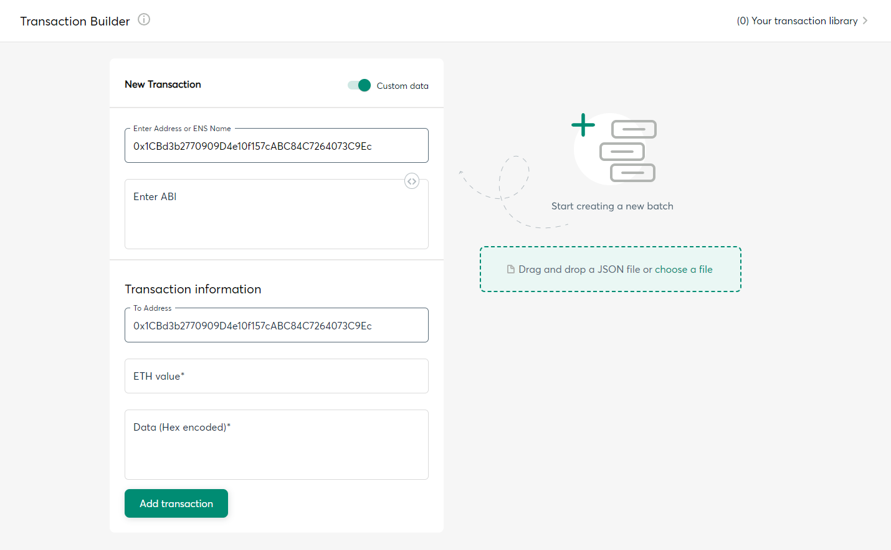

# Safe多签钱包实践

Safe原名：Gnosis Safe

Safe应用地址：https://app.safe.global/

Safe多签钱包是一个智能合约账户，只不过这个智能合约账户功能比较强大，需要多人签名才能将资产转出或调用其他合约，可用于集体资产管理。

### 创建Safe多签钱包
填写账户名，选择网络。


输入多签Owners钱包地址，选择交易所需的账户签名个数。


确认多签Owners钱包地址。


支付相关费用，支付完成后开始创建钱包。


### Safe多签钱包转入
往Safe多签钱包转入资产比较简单，直接往智能合约账户地址转账就可以。

点击左边Home主页按钮。


点击中间Receive按钮可以查看多签账户地址和二维码。往这个地址直接转账即可。


### Safe多签钱包转出和合约交互

转出和合约交互操作需要Owners签名。

点击主页中的Send按钮，打开创建交易界面，可以创建3种类型的交易。

- Send tokens        : 发送代币
- Send NTFs          ：发送NTF
- Transaction Builder：合约交互


点击Send tokens，填写Token转出相关信息。（Send NTFs 类似）


点击Transaction Builder，填写合约交互相关信息。



交易信息填写完成后，需要2/3个Owners签名才能创建交易。
等待矿工确认完成，交易完成。

---

### Safe多签钱包JS交互流程

创建EthersAdapter实例

```
const ethAdapter = new EthersAdapter({
    ethers,
    signerOrProvider: signerOwner1
})
```

创建safeSdk对象

```
const safeSdk: Safe = await Safe.create({ ethAdapter, safeAddress })
```

创建Safe交易

```
const safeTransactionData: MetaTransactionData = {
    to: 'toAddress',
    value: String(ethers.parseEther("0.01")),
    data: '0x'
}
const safeTransaction = await safeSdk.createTransaction({ transactions: [safeTransactionData] })
```

创建交易后，签名所有者可使用链下Safe客户端签名，或使用链上签名。

---

执行命令:

```shell
npx hardhat run .\scripts\safe-multisig-wallet.ts --network sepolia
```

打印输出：

```
ethers version:  6.9.2

 设置网络...

 获取账户...
网络设置：使用远端RPC网络 sepolia

 账户列表...
signerOwner1:  0x6BBC************************************
signerOwner2:  0xeBA0************************************

 创建EthersAdapter实例...

 创建safeSdk对象...

 Safe交互...
safeAddress:  0x9F83************************************
contractVersion:  1.3.0
ownerAddresses:  [
  '0x6BBC************************************',
  '0xeBA0************************************'
]
nonce:  3
threshold:  2
chainId:  11155111n
balance:  170000000000000000n
guardAddress:  0x0000000000000000000000000000000000000000
moduleAddresses:  Result(0) []
0x6BBC************************************ is owner? true
0xeBA0************************************ is owner? true
0xBcd4************************************ is owner? false

 创建Safe交易(2/2多签)...

 等待signerOwner1链上签名...

 等待signerOwner2链上签名...

 Safe交易完成...
```


### 参考文章

[Safe开发者文档](https://docs.safe.global/getting-started/readme)

[多签钱包Gnosis Safe交互教程](https://mirror.xyz/0x15d789D4Dd128CEA5D8E6b6f0adAbe910e5Fd100/oRZCwAL_YdgksKZFd9HpCnITGM4bJ4UkIQ4MdgL-OrA)

[多签钱包Gnosis Safe使用教程](https://mirror.xyz/iamdk.eth/AiicRuqXRadeCoU38IyV7h1YmPEo8fmXF_eLLOEdyeA)

[@safe-global/protocol-kit插件指导](https://www.npmjs.com/package/@safe-global/protocol-kit?activeTab=readme)